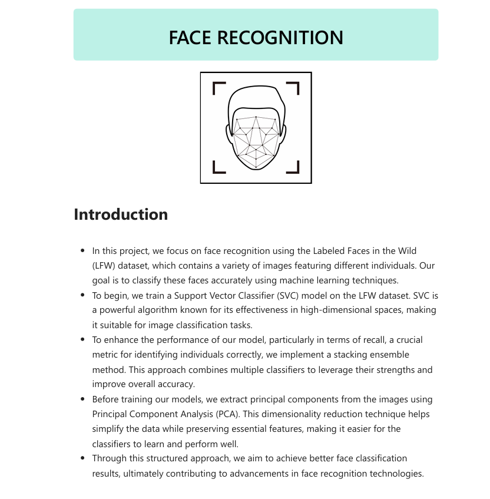

# Ensemble-Learning---Stack-Generalization

## Face Recognition with Stacking Model

This file explores different machine learning algorithms such as PCA for dimensionality reduction on an image dataset and the application of the ensemble learning technique **"stacking"** (stacked generalization) with various base learners, followed by prediction using a meta-model for face recognition.
